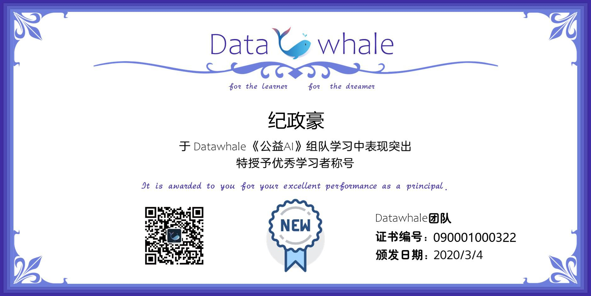

# 14-days-DL-challenge-pytorch💪
2020年Datawhale、伯禹教育、和鲸社区合作组织的14天《动手学深度学习》pytorch版课程代码   

课程地址：https://www.boyuai.com/elites/course/cZu18YmweLv10OeV

项目中上传了代码中用到的一些相关[数据集](/dataset/)和[d2l包](/package/)，方便大家下载

**Star⭐ me if you find useful🤣**    

## 结营证书 & 优秀学习者证书🎓




## 从Kesci平台下载数据集

```python
import os
cp_str = 'cp -r /home/kesci/input/nltk_data3784/nltk_data /home/kesci/work'
os.system(cp_str)
tar_str = 'tar czvf /home/kesci/work/nltk_data.tar /home/kesci/work/nltk_data'
os.system(tar_str)
print('finish')
```

## 学习内容与进度

- [线性回归](/code/1-线性回归.ipynb)🍦  

- [Softmax与分类模型](/code/2-Softmax与分类模型.ipynb)🍦  

- [多层感知机](/code/3-多层感知机.ipynb)🍦  

- [过拟合欠拟合及其解决方案](/code/4-过拟合欠拟合及其解决方案.ipynb)🍦  

- [梯度消失、梯度爆炸](/code/5-梯度消失、梯度爆炸.ipynb)🍦  

- [卷积神经网络基础](/code/6-卷积神经网络基础.ipynb)🍦  

- [LeNet](/code/7-LeNet.ipynb)🍦  

- [卷积神经网络进阶](/code/8-卷积神经网络进阶.ipynb)🍦  

- [批量归一化和残差网络](/code/9-批量归一化和残差网络.ipynb)  

- [文本预处理](/code/10-文本预处理.ipynb)🍦  

- [语言模型](/code/11-语言模型与数据集.ipynb)🍦  

- [循环神经网络基础](/code/12-循环神经网络.ipynb)🍦  

- [循环神经网络进阶](/code/13-GRU,LSTM,深层RNN,双向RNN.ipynb)🍦  

- [机器翻译](/code/14-机器翻译.ipynb)🍦  

- [注意力机制与Seq2Seq](/code/15-注意力机制和Seq2seq模型.ipynb)🍦  

- [Transformer](/code/16-Transformer.ipynb)🍦  

- [凸优化](/code/17-凸优化.ipynb)🍦     

- 梯度下降   

- 优化算法进阶   

- [数据增强](/code/20-数据增强.ipynb)🍦  

- [模型微调/迁移学习](/code/21-模型微调.ipynb)🍦      

- 目标检测基础  

- [图像风格迁移](/code/23-图像风格迁移.ipynb)🍦     

- [图像分类案例1](/code/24-图像分类案例1.ipynb)🍦  

- [图像分类案例2](/code/25-图像分类案例2.ipynb)🍦  

- [word2vec](/code/26-word2vec.ipynb)🍦     

- [词嵌入进阶](/code/27-词嵌入进阶.ipynb)🍦  

- [文本分类](/code/28-文本分类.ipynb)🍦  

- GAN   

- DCGAN     

## 参考资料

《动手学深度学习》中文版官网教材：http://zh.gluon.ai/   

部分PyTorch代码来自GitHub开源仓库：https://github.com/ShusenTang/Dive-into-DL-PyTorch    

PyTorch中文文档：https://pytorch-cn.readthedocs.io/zh/stable/    